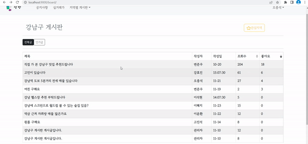
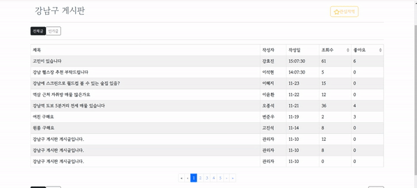
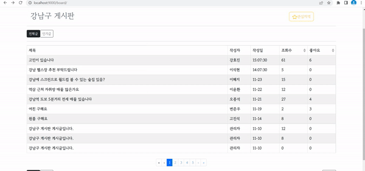

# 🏡 SeokBang

🔔 **삼성 청년 SW 아카데미(SSAFY)** 1학기 관통 프로젝트

  

## **개요**

- 공공데이터를 활용하여 지역별, 아파트별 실거래가 조회 결과를 제공
- 지역별 게시판을 통해 유저 간의 상호 커뮤니케이션 공간 제공

  

## 프로젝트 기간

- 2022년 11월 16일 ~ 2021년 11월 25일

  

## 기술 스택

  
   
  
  
   
   
   
  

######   

## 팀원

<table>
  <thead>
    <tr>
      <th>이름</th>
      <th>역할</th>
      <th>구현 기능</th>
    </tr>
  </thead>
  <tbody>
    <tr>
      <td rowspan="2">오종석</td>
      <td rowspan="2">팀장</td>
      <td>실거래가</td>
    </tr>
    <tr>
      <td>유저 관리</td>
    </tr>
    <tr>
      <td rowspan="2">고진석</td>
      <td rowspan="2">팀원</td>
      <td>게시판, 공지사항</td>
    </tr>
    <tr>
      <td>레이아웃</td>
    </tr>
  </tbody>
</table>

  

## **ERD(ER Diagram)**

  

## **UML(Usecase Diagram)**

  

## 실행 화면

### 🔗 메인 페이지

✅ 메인페이지 - 키워드로 실거래가 검색, 최근 공지사항 확인 기능

  

### 🔗 메인 페이지 - 키워드 검색

✅ 메인페이지에서 키워드(아파트명, 동명)로 해당 실거래가 조회 기능

  

### 🔗 메인 페이지 - 공지사항

✅ 메인페이지에서 최근 공지사항 조회 가능(관리자 계정으로만 작성, 수정, 삭제 가능)

  

---

### 🔗 유저관리

  

### 🔗 유저관리 - 회원가입

✅ 회원가입 - Validation Check(ID 중복, PW 안전성 및 일치, 유효한 이름 및 생년월일(미래, 윤년 체크 등))

  

### 🔗 유저관리 - 로그인, 로그아웃

✅

  

### 🔗 유저관리 - 회원정보 수정, 탈퇴

✅

  

---

### 🔗 실거래가 페이지

✅ 지역 별로 아파트 목록 검색, 지도위의 마커로 실거래가 검색, 키워드로 실거래가 검색 기능

  

### 🔗 실거래가 페이지 - 지역별 검색

✅ 시, 구/군을 선택하면 지도 위에 해당 지역 아파트 목록 표시, 마커 클릭 시 해당 아파트 실거래가 조회

  

### 🔗 실거래가 페이지 - 키워드 검색

✅ 키워드(아파트명, 동명)를 직접 입력하여 키워드가 포함된 모든 실거래가 조회

  

---

### 🔗 게시판

✅ 지역별(구/군) 게시판을 통해 해당 지역 사용자들 사이의 소통 및 상호작용 가능

  

### 🔗 게시판 - 인기글

✅ 인기글 탭을 통해 좋아요가 몇 이상인 게시글만 표시 기능, 조회수나 좋아요 순으로 게시글 정렬 기능

  

### 🔗 게시판 - 게시글 작성

✅

  

### 🔗 게시판 - 게시글 수정 삭제

✅

  

### 🔗 게시판 - 댓글 작성 삭제

✅ 게시글에 댓글을 작성하고 본인이 작성한 댓글만 삭제 가능.

  

### 🔗 게시판 - 좋아요

✅

  

---

### 🔗 관심지역

✅ 각 지역 게시판에서 관심지역 버튼을 통해 등록, 해제가 가능

✅ 관심지역 모달을 통해 등록된 관심지역 조회가 가능하고, 관심지역 해제와 해당 지역 게시판으로 이동도 가능

  
