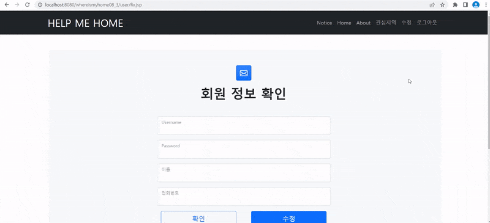

# SSAFY 여섯번째 관통프로젝트

### 팀원 

| 팀원   | 
| ------ |
| 오종석 | 
| 고진석 | 

---

### 구현 체크리스트

| 난이도 | 요구 사항명                            | 요구사항 상세                                                  | 완성 여부 |
| :----: | :----------------------------------    | ----------------------------------------------                | :-------: |
|  필수  | 주택 실거래가 정보 수집                  | 국토교통부 : 실시간 실거래가를 얻어와 화면에 표시.                |    ⭕     |
|  필수  | 주택 실거래가 검색                      | 주택 실거래가 정보를 원하는 검색 정보에 따라검색 결과 데이터 제공   |    ⭕     |
|  필수  | 관심 지역 정보 관리                     | 관심지역을 설정 ,조회하는 기능을 제공                             |    ⭕     |
|  필수  | 회원관리                                 | 회원정보 가입, 수정, 검색                                      |    ⭕     |
|  필수  | 로그인관리                                | 로그인/ 로그아웃/ 비밀번호 찾기                                |    ⭕     |

---

### 💻 프로그램 실행 예시

#### 메인화면.

#### 회원가입 로그인.

#### 회원정보수정.

#### 아파트 거래정보.

#### 관심지역 추가 삭제

#### REST response

